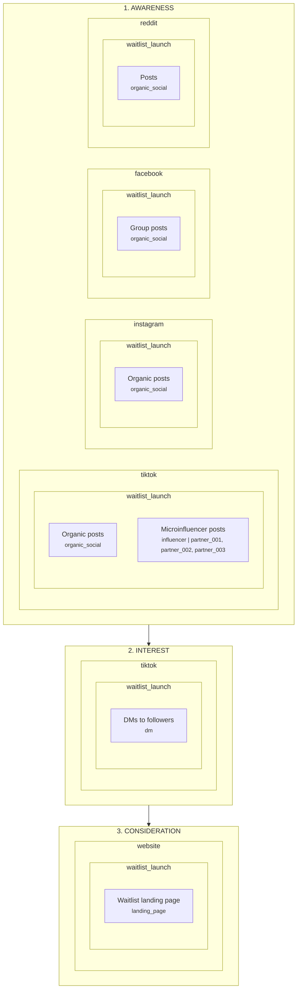

# Marketing Funnel

> **Generated:** 2026-04-01 22:13 UTC  
> **Source:** `funnel.yaml`  
> 
> This file is auto-generated from the YAML source of truth.
> **Do not edit this file** -- changes here will not update the funnel
> and will be overwritten on the next run. To modify the funnel,
> edit `funnel.yaml` and re-run `generate_funnel_diagram.py`.

